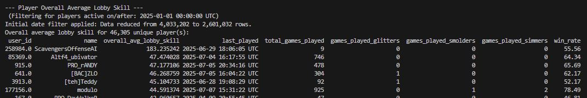

# Modular Dataframes Viewer for CSVs exported from PostgreSQL

Script that displays aggregate data from csv's. CSV's are from PostgreSQL derived.replays and derived.match_players.



## Example
```bash
python -m src.main wins-above-os-leaderboard --maps "All That Glitters v3.0, All That Smolders v1.2, All That Glitters v1.0, All That Glitters v1.1, All That Glitters v1.2, All That Glitters v2.0, All That Glitters v2.1, All That Glitters v2.2, All That Smolders v1.1.1, All That Simmers v1.0.2, All That Simmers v1.1, All That Simmers v1.1.1" --os-thresholds "45,40,30,25,20" --since-date 2025-01-01
```

## Key Improvements

- **Decoupled Architecture**: Each report is a self-contained class, making it easy to add, remove, or modify reports without affecting other parts of the system.
- **Dynamic CLI**: The command-line interface is generated automatically from the available `Report` classes. Adding a new report automatically exposes it via the CLI.
- **Centralized Data Service**: All data loading, merging, and caching is handled by a single `DataService`, eliminating redundant code.
- **Clear Responsibilities**:
  - `src/analysis`: Contains pure, reusable data analysis functions.
  - `src/reports`: Contains the implementation for each specific report.
  - `src/core`: Provides the core application framework (`Report` base class, `DataService`).
  - `src/cli`: Manages user interaction.
  - `src/main.py`: The single application entry point.

## Setup

1.  Install dependencies:
    ```bash
    pip install pandas pyarrow pytz
    ```
2.  Place your data files (`match_players...csv`, `replays...csv`) in a `data/` directory at the project root.

## Usage

The application uses a command-subcommand structure.

**To see all available reports:**

```bash
python -m src.main --help
```

**To run a specific report and see its options:**

```bash
python -m src.main <report-name> --help
```

### Examples

**Get top 15 most played maps:**

```bash
python -m src.main top-maps -n 15
```

**Get player skill report for players active since Jan 15, 2025:**

```bash
python -m src.main player-skill --since-date 2025-01-15
```

**Find all games played by a player named 'Archon':**

```bash
python -m src.main filter-player Archon
```

**Generate the OS leaderboard for specific maps and thresholds:**

```bash
python -m src.main wins-above-os-leaderboard --maps "All That Glitters v3.0,All That Smolders v1.2" --os-thresholds "45,40,35"
```
